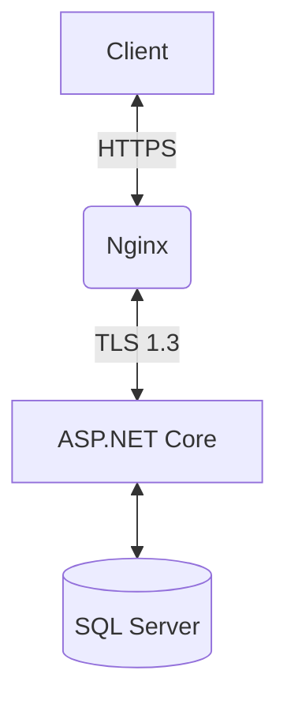

# TrustMessage - Security Exploration Project


TrustMessage is a student project created to explore and understand modern security practices in web application development. The primary goal was not to create a production-ready or user-friendly application but to experiment with and implement various security mechanisms that could be used in future projects.

## 🎯 Project Goals
- 🧠 Understand and implement core security concepts
- 🔍 Explore different encryption and authentication methods
- 🛠️ Test security implementations in a controlled environment
- 📚 Build a knowledge base for future secure application development

## 🔒 Security Features Implemented
- **End-to-End Encryption** (RSA-2048 with PBKDF2 key derivation)
- **Two-Factor Authentication** (TOTP-based Time-sensitive Codes)
- **Message Integrity Verification** (Digital Signatures with SHA-256)
- **Advanced Sanitization** (HTML/Markdown sanitizer with CSP protections)
- **Rate Limiting** (IP-based request throttling)
- **Secure Password Policies** (Minimum 60-bit entropy requirement)
- **Session Security** (HTTP-only, Secure cookies with SameSite strict)
- **Automatic Account Lockout** (After 5 failed attempts)

## 👤 User Capabilities
- **Registration with 2FA**: Upon registration, users receive a **unique QR code** for setting up Two-Factor Authentication (TOTP) using an authenticator app.
- **Login with 2FA**: Users must enter their credentials along with a time-sensitive **2FA code** to access the system.
- **Create Secure Messages**: Users can create messages formatted in **Markdown**. Each message is **signed** using the user's **encrypted private key**, which is securely stored and protected with their password.
- **View Message Threads with Verification**: Users can browse message threads and see whether a message is **verified**, ensuring authenticity. Verification is performed using **RSA digital signatures**.
- **Change Password with 2FA**: Users can change their password but must first authenticate via **Two-Factor Authentication** to prevent unauthorized changes.

## 🔑 How Message Signing Works
1. When a user creates a message, it is formatted using **Markdown** and sanitized to prevent XSS attacks.
2. The user’s **private key** is decrypted using their **password**.
3. The message content is signed using **RSA-2048** and **SHA-256**.
4. The signed message is stored in the database along with the signature.
5. Other users can verify the integrity of the message by checking the signature against the user's **public key**.

## 🔍 Message Verification Process
1. When fetching messages, the system retrieves the **public key** of the message author.
2. The signature is checked against the **message content** to verify authenticity.
3. Messages with a valid signature are marked as **Verified ✅**; otherwise, they are **flagged as Unverified ❌**.

## 🛠️ Technology Stack

### Frontend
- React.js with Vite
- Axios for secure API communication

### Backend
- ASP.NET Core 8.0
- Entity Framework Core

### Security
- OTP.NET for 2FA
- Markdig + HtmlSanitizer for content safety
- RSA/PBKDF2 for cryptographic operations
- Nginx with TLS 1.3 termination

### Database
- Microsoft SQL Server 2022
- Encrypted connections (TDS over TLS)

## 🚀 Getting Started

### Prerequisites
- Docker 20.10+
- OpenSSL 3.0+
- .NET 7.0 SDK

```bash
# Clone & Run
git clone https://github.com/ArtemkaGoldMan/TrustMessage.git
cd TrustMessage
./run-docker.sh
```

Access the application at:
- HTTPS: `https://localhost`
- HTTP: `http://localhost` (auto-redirects to HTTPS)

## 🛡️ Security Architecture



### Key Security Components:
1. **Key Derivation**: PBKDF2-HMAC-SHA256 with 100,000 iterations
2. **Message Signing**: RSA-2048 signatures for each message
3. **Session Protection**: Encrypted cookies with 30m expiration
4. **Content Security**:
   - Strict CSP headers
   - Markdown-to-HTML conversion with tag whitelisting
   - URL validation regex for all links

## 📂 Project Structure

```
TrustMessage/
├── TrustMessageApp/         # .NET Core Backend
│   ├── Controllers/         # Secure API endpoints
│   ├── Security/            # Cryptographic implementations
│   └── Services/            # Business logic
├── TrustMessageWeb/         # React Frontend
│   ├── src/services/        # Secure API clients
│   └── public/              # Static assets
├── nginx/                   # TLS configuration
└── docker-compose.yml       # Production deployment
```

---
This project serves as a **research and learning** initiative focused on implementing **strong security mechanisms**. It is **not intended for production use** but lays the groundwork for future secure application development.

